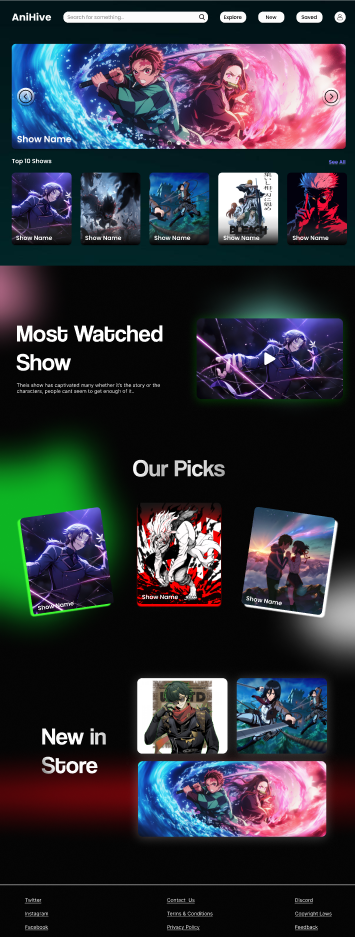
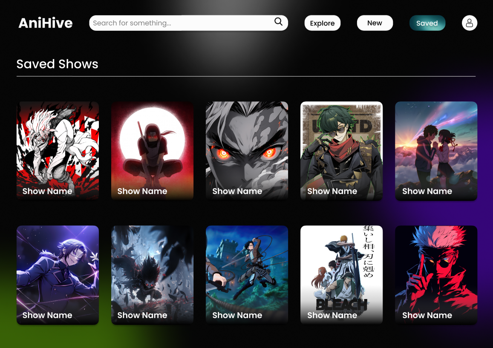
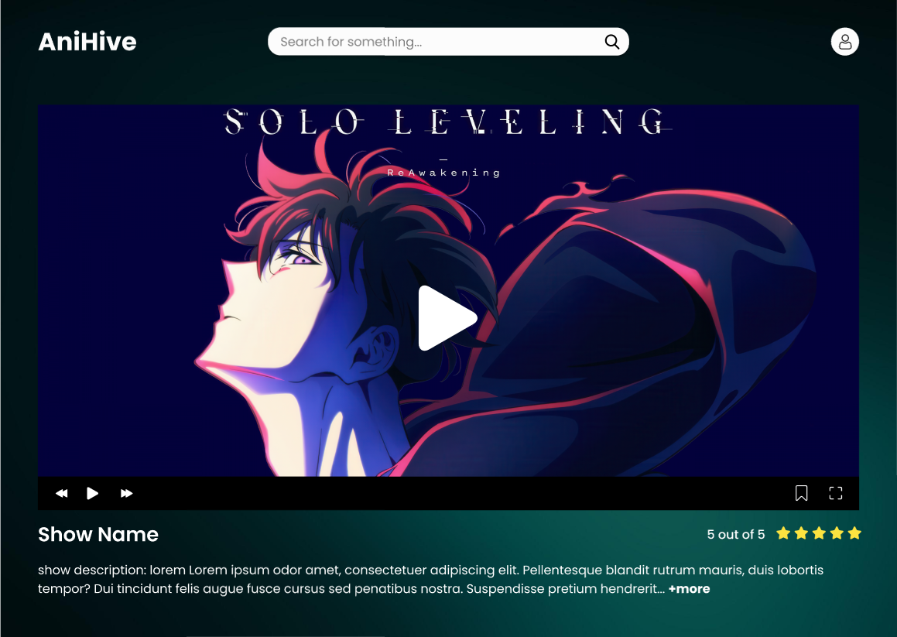

# 🎌 AniHive – Anime Streaming UI Design  

AniHive is a modern **anime streaming website UI** designed to make anime watching effortless with a **clean, aesthetic, and user-friendly experience**. The design focuses on smooth navigation, intuitive layouts, and a visually appealing interface.  

## 🌟 Features  

- 🔐 **Login Page** – Secure and seamless user authentication.  
- 🏠 **Landing Page** – Discover trending and recommended anime.  
- 📁 **Saved Show Page** – A personalized list of bookmarked anime.  
- ▶️ **Show Player Page** – A sleek and immersive video player for anime streaming.  

## 📸 Screenshots    

### 🏠 Landing Page  
  

### 📁 Saved Show Page  
  

### ▶️ Show Player Page  
  

## 🎨 Design Approach  

- **Aesthetic and modern UI** for a premium anime-watching experience.  
- **Minimalistic and intuitive layout** for effortless navigation.  
- **Dark mode-inspired theme** for a sleek and immersive feel.  
- **User-friendly interactions** to enhance accessibility.  

## 🛠️ Tools Used  

- **Figma**  
- UI/UX best practices for accessibility and usability  

